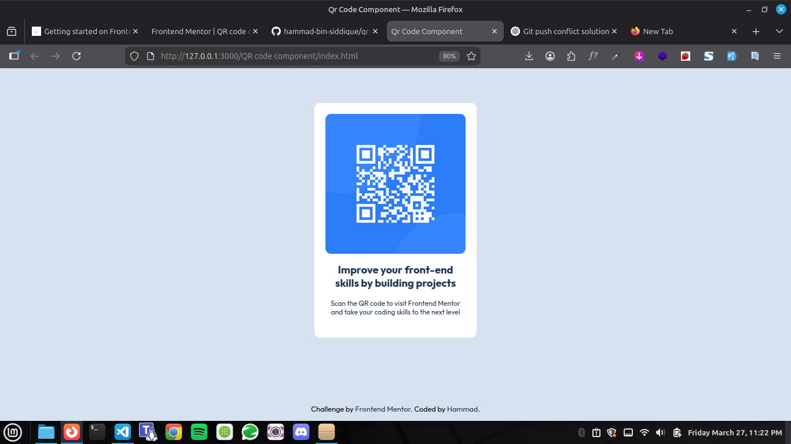
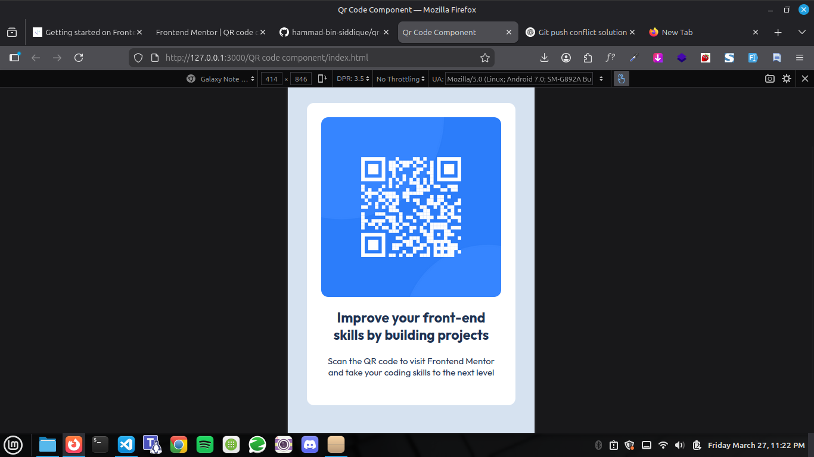

# QR Code Component 🖤

A modern and responsive QR Code component built with **pure HTML & CSS**.  
Designed to showcase a simple UI card for learning and practicing frontend development.

---

## 📸 Screenshots

  

---

## 🔥 Features

- Fully responsive layout  
- Minimal and clean design  
- Uses Google Fonts (`Outfit`)  
- Works on all screen sizes (desktop & mobile)  
- Includes a footer linking to Frontend Mentor challenge and author

---

## 🛠️ Technologies Used

- HTML5  
- CSS3  
- Google Fonts (`Outfit`)

---

## 📁 Project Structure

QR code component/

├── index.html

├── style.css

├── images/

│ ├── image-qr-code.png

│ └── favicon-32x32.png

└── screenshots/

├── desktop-view.png

└── mobile-view.png

---

## 🌐 Live Demo

Check the live version on Vercel: [QR Code Component](https://qr-code-component-mocha-two.vercel.app/)

---

## 👨‍💻 Author

**Hammad Siddique** — [GitHub](https://github.com/hammad-bin-siddique)

---

## 📞 Contact

WhatsApp: [+92 324 5469030](https://wa.me/923245469030)

---

## 📌 Notes

This project is part of [Frontend Mentor](https://www.frontendmentor.io/) challenges for practicing responsive layouts and UI components.
